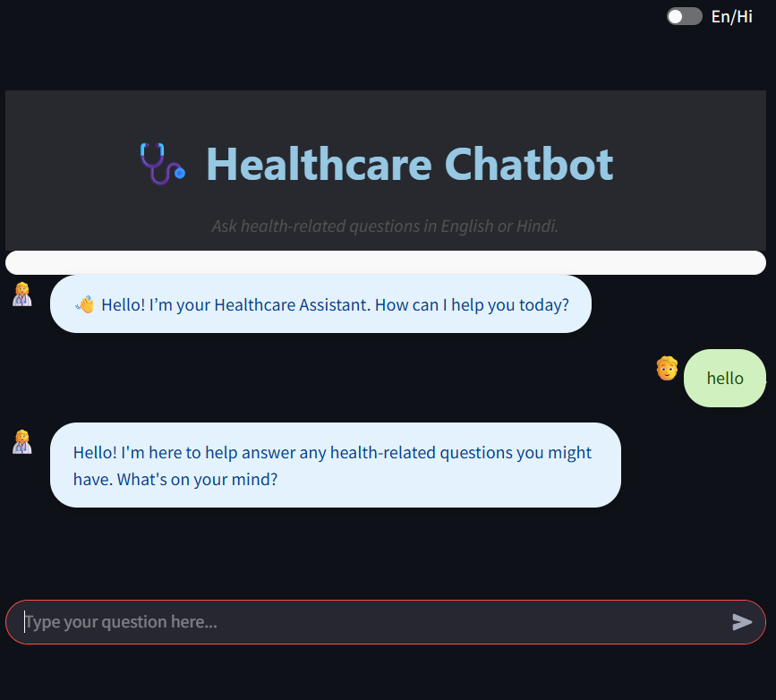

# 🩺 Healthcare Chatbot using RAG (Retrieval-Augmented Generation)

Welcome to the **Healthcare Chatbot**, an intelligent question-answering application built using the **Retrieval-Augmented Generation (RAG)** pipeline with **LangChain**, **OpenAI**, and **Streamlit**. This chatbot provides contextually accurate responses by retrieving information from a preloaded knowledge base.

> 🔬 **Project Type**: Internship Assignment  
> 🚀 **Frontend**: Streamlit  
> 🧠 **Backend**: Python, LangChain, OpenAI  
> ☁️ **Deployment**: Backend on Render, Frontend on Streamlit

---

## 📌 Project Objective

This project is part of an internship assignment to evaluate skills in:
- Retrieval-Augmented Generation (RAG)
- LangChain Framework
- Python (Data loading, processing, and API integration)
- Streamlit for web-based chat interface

The chatbot is capable of answering user queries accurately by combining retrieval-based and generative techniques.

---

## 🧱 Tech Stack

| Layer        | Technology |
|--------------|------------|
| Frontend     | Streamlit |
| Backend      | Python, LangChain, OpenAI |
| Data Format  | JSON |
| Deployment   | Streamlit (Frontend) + Render (Backend) |

---

## 🧠 RAG Architecture Overview

**Retrieval-Augmented Generation (RAG)** combines the power of:
- **Retriever**: Retrieves relevant chunks from your dataset.
- **Generator**: Uses a language model (OpenAI GPT) to generate answers using retrieved context.

### 🔄 Workflow

1. **User Input**: User asks a question in the chat interface.
2. **Retriever**:
   - LangChain retriever fetches the most relevant context from the preloaded JSON knowledge base.
3. **LLMChain (LangChain)**:
   - The retriever output is passed to the LLMChain which combines context + user query.
   - An OpenAI LLM generates a response based on this information.
4. **Response**: The answer is returned to the user via Streamlit UI.

### 🖼️ RAG Flow Diagram
> *(Refer to the images provided in the repository)*

